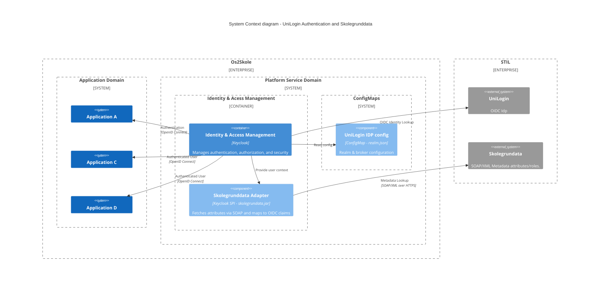

# Os2Skole
## Identity and Acess Management

```mermaid
C4Context
  title System Context diagram - UniLogin Authentication and Skolegrunddata
  
  %% --- The Entire Enterprise Context ---
  Enterprise_Boundary(OrgBoundary, "Os2Skole") {

    %% APPLICATION DOMAIN
    System_Boundary(Application, "Application Domain") {
      System(appA, "Application A", "")
      System(appC, "Application C", "")
      System(appD, "Application D", "")
    }
          
    %% PLATFORM DOMAIN
    System_Boundary(platform, "Platform Service Domain") {
      Container_Boundary(Keycloak, "Identity & Acess Management") {
        Container(keycloak_core, Identity & Access Management, "Keycloak", "Manages authentication, authorization, and security")
        %% Component definition inside the Container for visual grouping
        Component(spi, "Skolegrunddata Adapter", "Keycloak SPI - skolegrundata.jar", "Fetches attributes via SOAP and maps to OIDC claims")
      }
      System_Boundary(configmaps, "ConfigMaps") {
        Component(config, "UniLogin IDP config", "ConfigMap - realm.json", "Realm & broker configuration")
      }
    }
  }


Enterprise_Boundary(STILBoundary, "STIL") {
    System_Ext(unilogin, "UniLogin", "OIDC Idp")
    System_Ext(skolegrundata, "Skolegrundata", "SOAP/XML Metadata attributes/roles.")
}
  
  
  %% --- Relationships (The Flow) ---

  %% Identity Brokering
  Rel(keycloak_core, config, "Read config")
  Rel(keycloak_core, unilogin, "OIDC Identity Lookup")
  Rel(keycloak_core, spi,"Provide user context")
  Rel(spi, skolegrundata, "Metadata Lookup", "SOAP/XML over HTTPS")
  Rel(keycloak_core, appA, "Authentication", "OpenID Connect")
  Rel(keycloak_core, appC, "Authenticated User", "OpenID Connect")
  Rel(keycloak_core, appD, "Authenticated User", "OpenID Connect")
  
  UpdateLayoutConfig($c4ShapeInRow="2")
```
