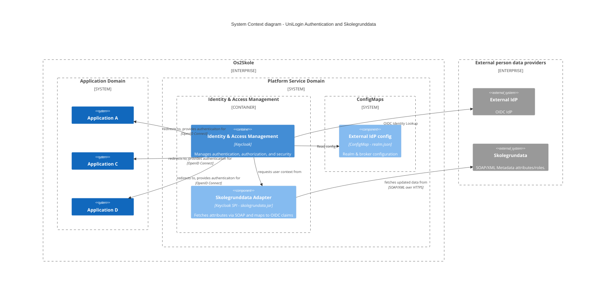

# 🎒 Os2Skole
## Identity and Acess Management

The Os2Skole Identity and Access Management (IAM) architecture is engineered to deliver a secure, scalable, and operationally efficient platform. This C4 system diagram illustrates the core components and their strategic relationships within the broader Os2Skole ecosystem and external services.

The core architecture is built on **six strategic pillars** to ensure reliability, security, and low operational cost:

| Strategic Pillar | Implementation Detail | Benefit |
| :--- | :--- | :--- |
| **Modularity** | An IAM service **implementing standard OpenID Connect** acts as a **separate, centralized Identity Provider** for the applications. | Loose Coupling of applications from identity logic. Reduced vendor lock-in. |
| **Vendor Neutrality** | Utilizes a **best of breed Open Source solution**. | Reduced licensing costs and reduced risk of vendor lock-in. |
| **Open Source Value** | Focus on **reuse** of existing open source solutions and potential **upstream contributions** |  Fosters community feedback and improves core platform quality. |
| **Exit Strategy** | *TBD* | Insulation from technology change risks; low-cost provider transition. |
| **Security** | **Security by Design** enforced via centralized IAM controls. | Consistent authentication and authorization across all applications. |
| **Maintainability** | Declaratively configured components.  | Simplified deployments and low-cost maintenance. |

This architecture delivers a **secure, adaptable, and sustainable** IAM platform by prioritizing standards, openness, and strategic separation of concerns.

---

