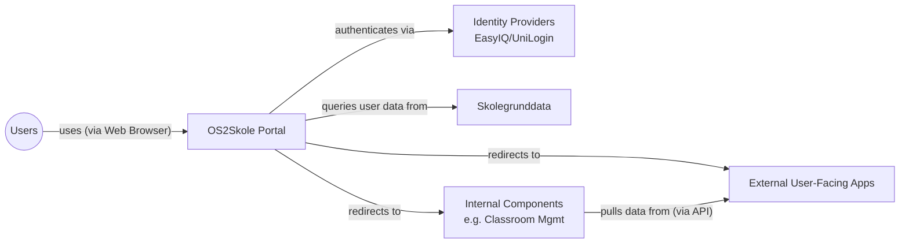

# OS2Skole Architecture Communication Canvas
*System: OS2Skole | Created by: @0xf1e | Date/Iteration: January 20th, 2026, first proposal*

## Value Proposition 💼

- Provide a school workspace for students in Danish elementary schools.
- Replace current closed-source applications (Google Workspace, Microsoft Office).
- Ensure EU sovereignty and avoid power imbalances towards global software corporations.

## Core Functions 📋

- Unified platform for documents and classroom communication.
- Exercise/Homework assignment and submission.
- Digital communication between teachers and students.
- Access to calendars, address books, and email management.
- Unified login for both internal components and externally supplied platforms.

## Key Stakeholder 🧑‍🧑‍🧒

- **Value for:** Students, teachers, and school administrators.
- **Development financed by:** OS2 (member municipalities).
- **Operations financed by:** Municipalities.
- **Customers:** 23 Danish municipalities, the largest of them being Aarhus, Aalborg, and Odense.
- **Contributors:** Multiple suppliers (selected on a per-component basis).

## Quality Requirements ⭐️

Terms are used as defined in the [ISO 25010 standard](https://iso25000.com/index.php/en/iso-25000-standards/iso-25010).

- Security (*Why?* We want student data to be safe, and actions in the system to be accountable and without repudiation.)
- Elasticity/Capacity (*Why?* We want the system to stay responsive under exam situations.)
- Learnability/Usability (*Why?* We want end users to be able to use the system with little external support.)
- Replaceability (*Why?* We want to replace existing "Big Tech" solutions.)
- Compatibility (*Why?* We do not want to get locked into specific providers' unique solutions.)
- Recoverability (*Why?* We want students to be able to trust that their work does not get lost.)
- Maintainability (*Why?* We want to run this project for a long time, with changing staff and changing requirements.)
- Legal compliance

## Business Context 🔗
Users access the system via web browsers. The system interfaces with Identity Providers (EasyIQ, UniLogin) and Skolegrunddata. The main portal redirects to external user-facing applications, while internal components (like the classroom management system) pull data from these external applications via APIs.

## Core Architectural Decisions 🚦

- We replace non-EU-sovereign components in the current student workspace infrastructure with open-source alternatives.  (*Why?* We consider open source components to be the best strategical fit.)
- We design our system to coexist and integrate with existing EU-sovereign components. (*Why?* We want to profit from the success of existing solutions and keep our project's scope within reason.)
- The project is developed as a Multi-provider setup, where specific components are handled by specialized providers. (*Why?* We want to foster a competitive landscape of specialized providers.)
- The connection between components in this project follows a microservices architectural style. (*Why?* It is the most amenable to an agile multi-provider development process.)
- We leave the individual implementation of the components up to the providers, as long as they meet the quality requirements. (*Why?* We want providers to be able to reuse parts of their existing technological stack.)
- We follow an agile development style, where we regularly incorporate feedback from test users and providers. (*Why?* It is the most likely to lead to a successful project outcome with a small team and budget.)

## Technologies 🛠️

- Specific technologies are to be determined through cooperation with component suppliers.
- **Key Patterns:**
    - Communication between components through APIs.
    - Whenever possible, backing services are accessed through open protocols rather than app-specific APIs.
    - Continuous Integration and Continuous Deployment (CI/CD).
    - Use of observability technologies.
    - For identity brokering, we use OIDC and OIDC Claims.

## Components / Modules 🧊

Proposed Logical Components: 

- Application access portal
- Document sharing
- Document editing
- Video calling
- Calendar viewing
- Email client
- Address book viewing
- Teacher exercise assignment
- Student exercise submission

Proposed Infrastructure Component Groups:

- Observability (like Auditing, Monitoring, Metrics, Incidents)
- Test Suite (like End2End, Integration, Load, Accessibility)
- Delivery Management (like CI/CD, Rollouts, Version Control)

## Technical Challenges and Risks ❓

- Can we identify the unknown unknowns behind this project as soon as they become relevant?
- Can we continuously incorporate end-user feedback in an effective way?
- Can we efficiently incorportate the experiences of the different infrastructure/module suppliers?

 Software Architecture Canvas is licensed under Attribution-ShareAlike 4.0 International. 
[https://canvas.arc42.org](https://canvas.arc42.org)
