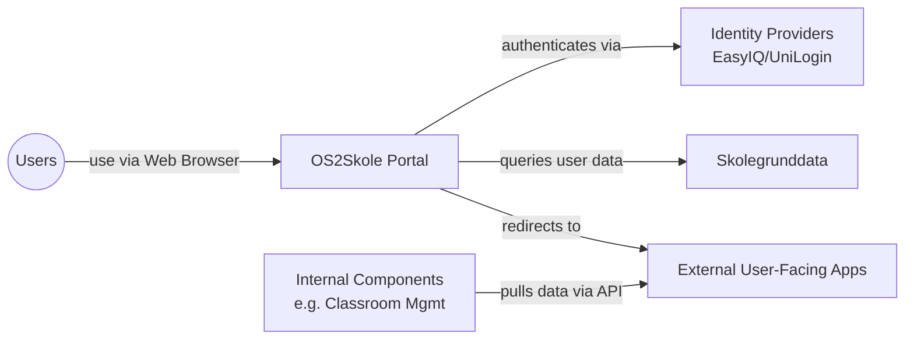

# OS2Skole Architecture Communication Canvas
*System: OS2Skole | Created by: @0xf1e | Date/Iteration: January 20th, 2026 |*

## Value Proposition 💼

- Provide a school workspace for students in Danish elementary schools.
- Replace current closed-source applications (Google Workspace, Microsoft Office).
- Ensure EU sovereignty and avoid power imbalances towards global software corporations.

## Core Functions 📋

- Unified platform for documents and classroom communication.
- Homework management.
- Digital communication between teachers and students.
- Access to calendars, address books, and email management.
- Unified login for both internal system components and external suppliers.

## Key Stakeholder 🧑‍🧑‍🧒

- **Value for:** Students, teachers, school operators, and school administrators.
- **Development financed by:** OS2 (member municipalities).
- **Operations financed by:** Municipalities.
- **Customers:** 23 Danish municipalities, the largest of them being Aarhus, Aalborg, and Odense.
- **Contributors:** Multiple suppliers (selected on a per-component basis).

## Quality Requirements ⭐️

Terms are used as defined in the [ISO 25010 standard](https://iso25000.com/index.php/en/iso-25000-standards/iso-25010).

- Security
- Elasticity/Capacity
- Learnability/Usability
- Replaceability
- Compatibility
- Recoverability
- Maintainability
- Legal compliance

## Business Context 🔗
Users access the system via web browsers. The system interfaces with Identity Providers (EasyIQ, UniLogin) and Skolegrunddata. The main portal redirects to external user-facing applications, while internal components (like the classroom management system) pull data from these external applications via APIs.

## Core Architectural Decisions 🚦

- Replace non-EU sovereign components with Danish partners and integrate them.
- Multi-provider setup where specific components are handled by specialized providers.
- Microservices architecture.
- Agile development style.

## Technologies 🛠️

- Specific technologies are to be determined through cooperation with module suppliers.
- **Key Patterns:**
    - Communication between modules through APIs.
    - Continuous Integration and Continuous Deployment (CI/CD).
    - Use of observability technologies.
    - OIDC (including OIDC claims).
    - Backing services accessed through open protocols rather than app-specific APIs.

## Components / Modules 🧊

- Identity brokering
- Document sharing
- Document editing
- Video calling
- Calendar viewing
- Email client
- Address book viewing
- Teacher exercise assignment
- Student exercise submission

## Technical Challenges and Risks ❓

- Can we identify the unknown unknowns behind this project?
- Can we continuously incorporate end-user feedback in an effective way?

 Software Architecture Canvas is licensed under Attribution-ShareAlike 4.0 International. 
[https://canvas.arc42.org](https://canvas.arc42.org)
