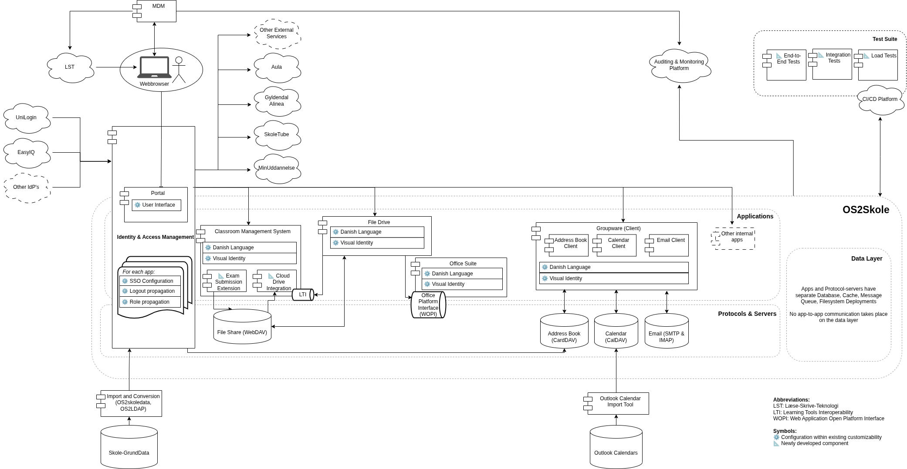

# OS2Skole: Infrastructure Overview

The following diagram serves as a basis to discuss and discover the OS2Skole architecture:

Here is a description of how we currently envision the system to work:

## Identity and Access Management

The Identity and Access Management (IAM) module is the central hub for managing user information and login authentication across the OS2Skole system. Think of it as a secure directory that knows who everyone is and what they're allowed to do. This module stores essential information about all system users: students, teachers, parents, and other stakeholders.

### How User Data Enters the System

User data flows into the system through two main channels:

1. **Identity providers** – Pre-existing login systems already used across Danish schools
2. **Skolegrunddata** – Denmark's central database of school information

The Danish educational landscape already has several established identity providers (services that verify who users are). These providers use standardized interfaces, which means we can connect to them directly without building custom integration code for each one.

Our IAM module communicates with these identity providers using OpenID Connect (OIDC) or SAML, open protocols that allow secure identity verification across different systems. In this setup, our IAM module acts as an **identity broker** – it collects user identities from various sources and then shares them with both internal OS2Skole applications and external educational applications used throughout Denmark.

The OS2Skoledata and OS2LDAP projects enhance this basic user information by adding additional details from Skolegrunddata, creating richer, more complete user profiles.

### The User Portal

The IAM module includes a portal that users see when they log in. This portal displays a button for each application they can access. These might include:

- **Internal applications**, for example: file drive, classroom management system, groupware suite (email, calendar, address book)
- **External systems**, for example: Aula, Skoletube

### Configuring Applications

Each application requires specific setup to work with the IAM system:

- **Security credentials**: Applications connect using shared token secrets and unique identifiers
- **Network locations**: The IAM system needs to know where each application's resources are located in the network (some of this can be simplified by the "Service Mesh" pattern mentioned below)
- **Logout coordination**: Each application must allow the IAM module to log users out, with logout actions propagating across all connected services
- **Role mapping**: The IAM module tracks each user's role (student, teacher, grade level, etc.)

Since different applications often have their own ways of defining user roles, we configure a translation of roles for each application. We map our standardized IAM roles to whatever role structure each application expects. While applications maintain their own user databases, they're built to integrate easily with external IAM systems like ours.

## Open Protocols for Interoperability

### The Flexibility Principle

OS2Skole is designed, so you can swap out one component for another without expensive rewrites. Imagine being able to replace your file storage system the way you might switch from one word processor to another – that's the goal.

We achieve this by avoiding custom integrations between components. Instead of having each piece of software talk directly to every other piece (which creates a tangled web of dependencies), we use **open protocols** – standardized languages that different software solutions already understand.

### How This Works in Practice

Consider file sharing between the classroom management system and the file drive. They communicate using **WebDAV**, an open standard for file sharing that many different software products support. 

Some information can't be transmitted through WebDAV alone, requiring direct API integration with the file drive. However, by handling most communication through open standards, we minimize these custom integrations.

The practical benefit: if we later decide to use different file storage software, the replacement is straightforward. Any professional file drive solution supports WebDAV – it's a standard feature, like USB ports on laptops.

### Protocols Used in OS2Skole

The system uses four main types of protocols, for different types of information:

- a file sharing protocol, likely **WebDAV**
- an address book synchronization protocol, likely **CardDAV**
- a calendar synchronization protocol, likely **CalDAV**
- an email communication protocol, likely **SMTP** and **IMAP**

### Benefits Beyond Internal Communication

This protocol-based approach also simplifies importing data from external systems. For example: Rather than writing custom code to import Outlook calendars into our specific calendar application, we use existing importers into the CalDAV standard. Our calendar applicaiton then reads this new information from the CalDAV server.

## Automated Testing and CI/CD

### Why Testing Matters

OS2Skole combines multiple components from different vendors, each updated independently on their own schedule. With so many moving parts, and potentially many updates a day, something could easily break when one component updates. Automated testing catches these problems before users encounter them.

Our **CI/CD platform** (Continuous Integration/Continuous Deployment) manages this process automatically. Each time a component updates, the platform runs tests and only allows the update to proceed if everything passes.

### Types of Tests

We can broadly categorize the tests into three types:

**1. End-to-End Tests**  
These simulate real user behavior. An automated script acts like a person using a web browser: clicking buttons, filling out forms, and checking that the right things appear on screen.
End-to-End tests can also involve interactions with external software, like Skoletube.

*Example*: A script logs in as a student, opens an assignment in the classroom management system, opens an attached file, edits it, and submits it – verifying that each step works without errors.

**2. Integration Tests**  
These verify that different components work together correctly by checking their outputs programmatically.

*Example*: Create a new user in the IAM system, then automatically check whether that user has the correct permissions in the classroom management system.

**3. Load Tests**  
These ensure the system remains stable when many people use it simultaneously.

*Example*: Simulate 500 students writing and submitting assignments at the same time, verifying that the system handles this load without slowing down or crashing.

The goal behind this is to avoid regressions.
A **regression** occurs when an update inadvertently breaks something that previously worked. A developer might fix one issue but accidentally create another. Automated testing catches these problems immediately, maintaining system stability even as individual components evolve.

## Multi-Provider Architecture

### Distributed Hosting Made Possible

OS2Skole's components communicate over networks rather than through direct system calls. This means different providers can host different parts of the system.

For example:
- Provider A hosts the file drive
- Provider B hosts the office suite
- Users experience them as a single, seamless application

A **service mesh** (a network management pattern) makes this possible by allowing distributed components to interact as if they were parts of one unified program. Even if the external network address of one of the components changes, the configuration of the other programs does not need to be changed.

### How Components Stay Compatible

Components only need to speak the same protocol language to work together. In the example of the office suite, the office suite provider ensures their software can receive information through **WOPI** (Web Application Open Platform Interface). The file drive provider ensures their software can send information through WOPI. As long as both sides implement the protocol correctly, they work together regardless of who hosts them.

### Staying Close to Standard Solutions

Because we use open protocols with standard implementations, providers can deploy software that closely resembles off-the-shelf solutions. This reduces customization costs and makes it easier to find qualified vendors.

### Maintaining a Consistent User Experience

For each application, we provide:

- **Language configuration files** that ensure all text appears in proper Danish
- **Visual styling guides** that help providers configure applications to look like parts of one cohesive system

Users shouldn't need to know (or care) that different components come from different providers. The experience should feel unified throughout.

# Further Reading

[Further details from the deployer's/supplier's perspective](./deployment.md)

[Non-Functional Requirements](./non_functional_requirements.md)
